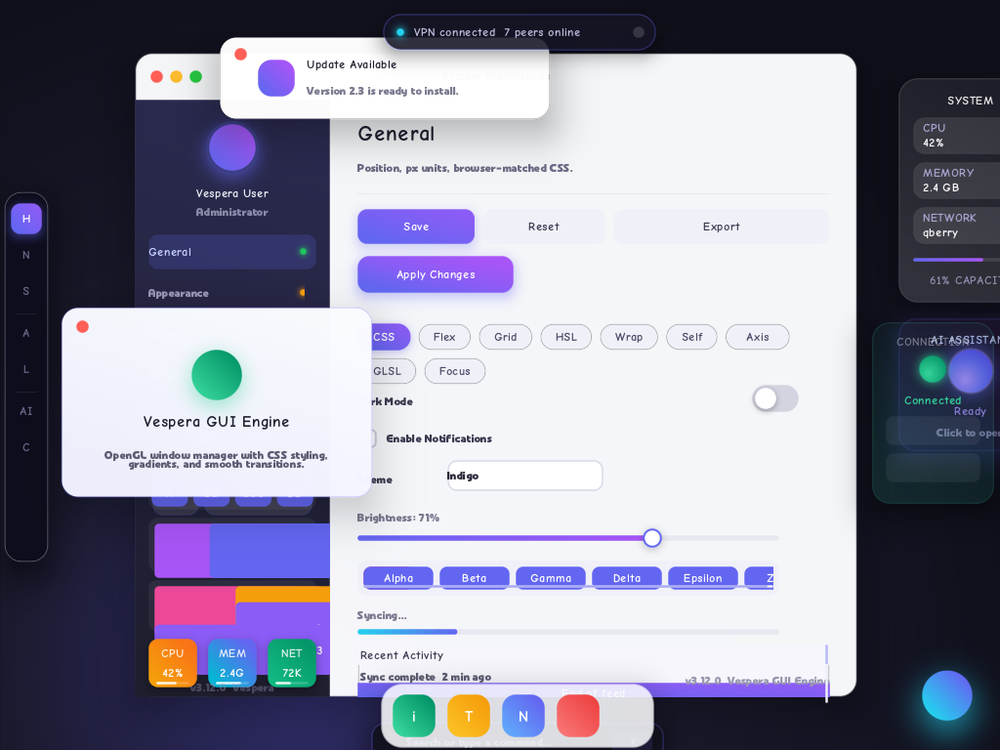

**🚀 Luna Desktop**

A **pure Rust** Wayland compositor + custom `libwayland-client` implementation + OpenGL desktop shell (`lu-shell` / `opengl_gui.c`). Run GTK4 apps while replacing Xorg or Weston!

[](https://github.com/sponsors/yui0)



---

## 🏷️ Product Names & Layers

| Name              | Actual Binary       | Role |
|-------------------|---------------------|------|
| **Luna Desktop**  | Full session        | The complete desktop environment users see after kernel boot |
| **lu-compositor** | `vespera-server`    | DRM/KMS Wayland compositor (Xorg/Weston replacement) |
| **lu-shell**      | `opengl_gui`        | Wallpaper, taskbar & shell UI (luUI engine) |
| **Luna UI**       | `opengl_gui.c` HTML/CSS engine | UI toolkit for shell & settings apps |
| **wayland-client-rs** | `libwayland_client.so` | Pure Rust client lib that GTK apps connect to |

**Internal codename:** Vespera
**User-facing name:** **Lu** (short, memorable, like GNOME/KDE)

## 🔄 Boot Flow (After Kernel)

```bash
systemd / init
  └─ lu-session
       ├─ lu-compositor  (vespera-server --backend dri) ✨
       ├─ lu-shell       (opengl_gui --desktop) 🖼️
       └─ GTK Apps       (WAYLAND_DISPLAY + LD_PRELOAD=libwayland-client) 📱
```

Wayland protocol is used as an **internal bus**. No Weston, Mutter, or Xorg needed. GTK4 connects directly to the Vespera compositor.

## 🛠️ Try It on Your Dev Machine

```bash
cd vespera
make desktop              # 🚀 DRI + lu-shell (GPU console)
make desktop-soft         # 💻 Software backend (great for VMs)

# Launch with GTK apps
LU_APPS="target/release/hello-gtk" make desktop
```

## 📦 Production Install (Launch Desktop on tty1)

```bash
sudo make install PREFIX=/usr/local
sudo systemctl enable lu-desktop.service
sudo systemctl start lu-desktop.service
```

Works alongside `getty@tty1` auto-login. For manual testing with existing sessions, just run `lu-session`.

## 📁 Directory Structure

```
vespera/
├── rust-toolchain.toml
├── Cargo.toml
├── Makefile
├── run-gtk                    # 🌐 WebGL browser launcher
│
├── wayland-client-rs/         # Pure Rust libwayland-client
├── wayland-server-rs/         # Pure Rust Wayland server (no libwayland-server!)
└── hello-gtk/                 # Sample GTK4 app
```

## ⚡ Quick Start

### 🌐 **WebGL Mode** – Run GTK4 Apps in Browser

```bash
cd vespera

# Build + show hello-gtk in browser
./run-gtk

# Any GTK4 app
./run-gtk gtk4-demo
./run-gtk /usr/bin/your-gtk-app

# Custom port
PORT=9090 ./run-gtk
```

Open `http://localhost:8081/` → Real-time 1280×720 RGBA streaming via WebGL!
🖱️ Click & type directly in the browser — input goes to the GTK app.

### 💻 **Software Rendering Demo**

```bash
make demo
# vespera-server runs in background
# GTK app connects via LD_PRELOAD
# Output saved to /tmp/vespera.ppm every frame
```

### 🎮 **DRI / Hardware Backend**

```bash
cargo build -p wayland-server-rs --features dri
./target/debug/vespera-server --backend dri
```

## 🛠️ Build Commands

```bash
cargo build                    # Software + DRI
cargo build --features webgl   # + WebGL backend

make build
make build-webgl
```

## 🎨 Luna UI CSS Engine (`ui/luna-ui.h`)

Single-header HTML/CSS → OpenGL renderer. Everything on screen is styled by CSS — no immediate-mode drawing.

**Selectors**: type / `.class` / `#id` / `*`, descendant & child (`>`) & sibling (`+`, `~`) combinators, `:hover` `:active` `:focus` `:focus-visible` `:focus-within`, `:first-child` `:last-child` `:nth-child(odd|even|An+B)`, `:not(...)`, `!important`, CSS variables (`var()`), `calc()`.

**Box**: flexbox (wrap, grow/shrink/basis, gaps, auto margins), grid (templates, areas, auto-flow), block flow, `position: static|relative|absolute|fixed|sticky`, `box-sizing`, min/max sizes, `overflow` + styled scrollbars + scroll-snap/smooth-scroll, `z-index`.

**Paint**: per-corner `border-radius`, borders, `linear-gradient` / `radial-gradient` (multi-stop), **multi-layer `box-shadow` with `inset` and spread**, `background-image: url()`, `opacity`, `transform: translate/scale` (px/%), `transition`, `@keyframes` animations.

**Text**: `font-size/weight`, `line-height`, `text-align`, `white-space`, `text-overflow: ellipsis`, `overflow-wrap`, **`letter-spacing`, `text-transform`, `text-decoration` (underline/line-through), `text-shadow`**, units `px` / `%` / `rem` / `em` / `pt`.

**Fast**: batched glyph rendering (one draw call per line), SDF shaders for rounded rects & Gaussian shadows with early-discard, dirty-flag relayout (layout only on change), viewport culling, cached z-order.

## 🧠 Design Highlights

### **wayland-server-rs** ✨
- Zero dependency on `libwayland-server`
- Full wire protocol compatibility
- Supports: `wl_compositor`, `wl_shm`, `wl_seat`, `xdg_wm_base`, `zwp_linux_dmabuf_v1` (v4)
- dmabuf path works with GTK4 using linear modifiers → easy CPU mapping

### **wayland-client-rs** 🔧
- Produces `libwayland_client.so.0` with proper SONAME
- Uses `#[unsafe(naked)]` assembly trampoline for `wl_proxy_marshal_flags`
- 79 symbols exported

### **WebGL Backend** 🌍 (feature = "webgl")
- Background TCP server
- Serves WebGL viewer on `/`
- WebSocket streaming of RGBA frames
- Real-time mouse/keyboard input forwarding:
  - `m X Y` → mouse move
  - `b BTN P` → button press/release
  - `k CODE P` → key press/release

---

**Ready to build the future of Linux desktops in pure Rust?** 🦀✨

Let’s make Lu Desktop the snappiest, most hackable desktop environment yet! 🚀
