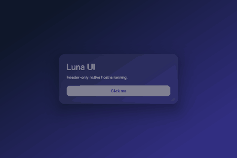
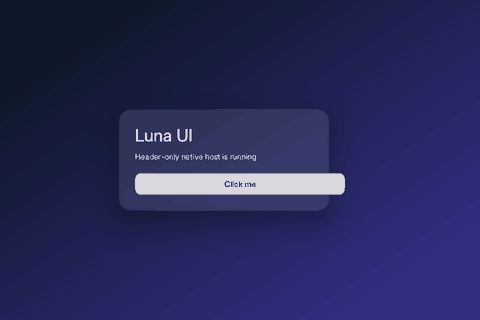

# 🌙 Luna UI

**Header-only, multiplatform HTML/CSS UI for native OpenGL applications.**

[](https://github.com/sponsors/yui0)

Luna UI parses HTML and CSS, lays out a lightweight DOM, and renders it directly with OpenGL. The same core is used by the built-in Windows, Linux, macOS, iOS, Android, and Web hosts.

`luna-ui.h` is the main public include. Define `LUNA_UI_IMPLEMENTATION` in exactly one translation unit and the appropriate native host is selected automatically.

## ✨ Screenshots

These are frames rendered by the real `examples/example.c` application and the current Luna UI renderer.

| Running example | Button hover | Click handler / DOM update |
| --- | --- | --- |
|  |  |  |

The screenshots were captured in a build environment without the GLFW development package by using a **capture-only minimal GLFW compatibility layer** backed by an off-screen Mesa/EGL OpenGL context. The application and Luna UI rendering code were left unchanged; the compatibility layer only supplied the small GLFW host surface needed to run the real app and read back the framebuffer.

## 🚀 Quick start

```c
#define LUNA_UI_IMPLEMENTATION
#include "luna-ui.h"

static const char* html =
    "<body><main class=\"card\">"
    "<h1>Hello, Luna UI</h1>"
    "<p>HTML/CSS rendered by native OpenGL.</p>"
    "</main></body>";

static const char* css =
    "body{display:flex;align-items:center;justify-content:center;"
    "background:#0f172a;color:white;}"
    ".card{padding:32px;border-radius:20px;background:#1e293b;}";

int main(void) {
    LunaAppConfig app = {0};
    app.title = "My Luna app";
    app.width = 960;
    app.height = 640;
    app.resizable = 1;
    app.vsync = 1;
    app.html = html;
    app.css = css;
    return luna_app_run(&app);
}
```

HTML/CSS can be supplied either as strings (`html`, `css`) or paths (`html_path`, `css_path`). `examples/example.c` also demonstrates registering a native C callback for an `onclick` handler and changing DOM text at runtime.

## 🧩 Current architecture

The repository currently consists of a shared UI/rendering core plus header-only platform hosts:

- `luna-ui.h` — DOM, CSS, layout, input, OpenGL renderer, public UI API, and `LunaPlatform` host ABI v2.
- `luna_windows.h` — Win32 + WGL/OpenGL host.
- `luna_linux.h` — GLFW + OpenGL host. Luna UI does not call X11/GLX directly from this backend.
- `luna_macos.h` — Cocoa + OpenGL host.
- `luna_ios.h` — UIKit + OpenGL ES host.
- `luna_android.h` — NativeActivity + EGL/OpenGL ES host.
- `luna_web.h` — Emscripten + WebGL 2 host.
- `luna-window.h` — optional reusable window chrome, themes, dialogs, toast/notification UI, and desktop file-dialog/file-manager support.
- `cssparser.h`, `stb_truetype.h`, `stb_image.h`, `stb_image_write.h` — bundled single-header dependencies.

There is no separate `luna_platform.h`. Platform selection is performed from `luna-ui.h` in the implementation translation unit.

## 🪟 Window and platform services

The built-in hosts provide the native window/context lifecycle and connect platform services to the shared `LunaPlatform` ABI. The current v2 ABI includes hooks for:

- OpenGL procedure lookup and monotonic time
- resource and font loading
- clipboard access
- IME/text-input activation
- cursor changes and display scale
- close, minimize, maximize, title changes, move and resize requests
- redraw requests
- PNG saving
- system notifications

`LunaPlatform` includes both `struct_size` and `api_version` (`LUNA_UI_API_VERSION` is currently `0x00020000`) so custom hosts can validate the host structure they provide.

Common helpers include:

```c
void  luna_clipboard_set(const char* utf8);
char* luna_clipboard_get(void);
void  luna_clipboard_free(char* utf8);
float luna_platform_scale(void);
```

## 🎨 `luna-window.h`

Applications that want consistent Luna-styled desktop chrome can additionally use `luna-window.h`:

```c
#define LUNA_UI_IMPLEMENTATION
#include "luna-ui.h"

#define LUNA_WINDOW_IMPLEMENTATION
#include "luna-window.h"
```

It provides standard titlebar/resize markup and CSS, light/dark/custom themes, alerts, confirmation and prompt dialogs, toast notifications, and notification fallback UI.

For the reusable desktop file dialog/file manager implementation, define `LUNA_WINDOW_FILE_DIALOG_IMPLEMENTATION` in the same translation unit as both implementation macros:

```c
#define LUNA_UI_IMPLEMENTATION
#include "luna-ui.h"
#define LUNA_WINDOW_IMPLEMENTATION
#define LUNA_WINDOW_FILE_DIALOG_IMPLEMENTATION
#include "luna-window.h"
```

The file-dialog API supports file manager, open file(s), select folder, and save file modes through `LunaFileDialogConfig` and `luna_file_dialog_run()`.

## 🖥️ Desktop builds

### Linux

The current Linux host uses GLFW for windowing/input and OpenGL for rendering:

```sh
cc -O2 -std=c11 examples/example.c -o luna-example \
  -lglfw -lGL -ldl -lm -lpthread
```

No direct `-lX11` dependency is required by Luna UI itself. The GLFW package used by your system may of course depend on X11 or Wayland internally.

### Windows / MSVC

```bat
cl /std:c11 /O2 examples\example.c
```

The Windows host uses Win32/WGL. With MinGW, link the normal Win32/OpenGL libraries (for example `opengl32`, `gdi32`, `user32`, `imm32`, and `shell32`).

### macOS

Compile the implementation translation unit as Objective-C or Objective-C++:

```sh
clang -O2 -x objective-c examples/example.c -o luna-example \
  -framework Cocoa -framework OpenGL -framework CoreText
```

Declaration-only users of `luna-ui.h` can remain ordinary C/C++ translation units.

## 🌐 Web

```sh
emcc examples/example.c -o examples/luna-example.js \
  -sUSE_WEBGL2=1 -sFULL_ES3=1 -sALLOW_MEMORY_GROWTH=1 \
  -sEXPORTED_FUNCTIONS=_main,_malloc,_free,_luna_web_commit_utf8 \
  -sEXPORTED_RUNTIME_METHODS=UTF8ToString,stringToUTF8,lengthBytesUTF8
```

Serve the `examples` directory over HTTP and open `examples/index.html`.

## 📱 iOS

Add `examples/example_ios.m` and the Luna headers to an iOS application target. Link UIKit, QuartzCore, OpenGLES, and CoreText. The iOS host supplies the application/view lifecycle, `EAGLContext`, touch input, and text input bridge.

## 🤖 Android

The Android host uses `android.app.NativeActivity`, EGL, and OpenGL ES 3. The implementation exports `ANativeActivity_onCreate`.

For NativeActivity builds the application config can be supplied before including the implementation:

```c
#define LUNA_ANDROID_APP_CONFIG luna_android_make_config
#define LUNA_UI_IMPLEMENTATION
#include "luna-ui.h"

LunaAppConfig luna_android_make_config(void) {
    LunaAppConfig app = {0};
    app.html_path = "ui/main.html";
    app.css_path = "ui/main.css";
    app.vsync = 1;
    return app;
}
```

Link `android`, `EGL`, `GLESv3`, `dl`, and `log`. Pack HTML, CSS, images, and bundled fonts in the APK assets as appropriate.

## 🔧 Custom host / embedding

The renderer can be embedded in another window system without any built-in host:

```c
#define LUNA_UI_NO_PLATFORM
#define LUNA_UI_IMPLEMENTATION
#include "luna-ui.h"
```

Create a compatible OpenGL context, populate `LunaPlatform`, call `luna_set_platform()`, initialize Luna with `luna_init()`, forward input events, and drive `luna_update()` / `luna_render()` from your own loop.

This is also the intended extension point for alternative window systems and future rendering hosts without changing the DOM/CSS/layout API.

## 📦 Implementation rules

- Define `LUNA_UI_IMPLEMENTATION` in exactly one translation unit.
- Keep the Luna headers and bundled single-header dependencies in the include tree.
- On macOS/iOS, compile the implementation translation unit as Objective-C/Objective-C++.
- Use `LUNA_UI_NO_PLATFORM` only when supplying your own host.
- Define `LUNA_WINDOW_IMPLEMENTATION` only if using the optional common window layer.

## 📝 Notes

The current renderer is shared across the native OpenGL/OpenGL ES/WebGL hosts. macOS OpenGL and iOS OpenGL ES are legacy Apple APIs, but they keep the host layer compact while the higher-level DOM, CSS, layout, input, and application APIs remain portable.

## 📄 License

This project is licensed under the **Mozilla Public License 2.0 (MPL-2.0)**.

Copyright (c) Yuichiro Nakada, Berry OS / Luna Desktop contributors.

See [LICENSE](LICENSE) for the full license text. Bundled third-party single-header libraries retain their original licenses.
